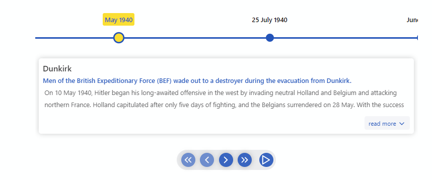

[](https://dev.azure.com/prabhummurthy/react-chrono/_build/latest?definitionId=7&branchName=master)
[](https://deepscan.io/dashboard#view=project&tid=10074&pid=13644&bid=234929)
[](https://www.codacy.com/manual/prabhuignoto/react-chrono?utm_source=github.com&amp;utm_medium=referral&amp;utm_content=prabhuignoto/react-chrono&amp;utm_campaign=Badge_Grade)
[](https://lgtm.com/projects/g/prabhuignoto/float-menu/context:javascript)

[](https://depfu.com/github/prabhuignoto/react-chrono?project_id=15325)


> A timeline component for React

## Features

✅ **Modes** - Layout the timeline either `Vertically` or `Horizontally` using the `mode` prop.
✅ **Tree** - In `Tree` mode the timeline cards are alternated between left and right.
✅ **Slideshow** - Play the timeline automatically with the `slideShow` prop.
✅ **Keyboard Support** - The timeline can be navigated with the <kbd>UP</kbd> , <kbd>DOWN</kbd> keys in `vertical` or `tree` mode. In `horizontal` mode <kbd>LEFT</kbd> , <kbd>RIGHT</kbd> keys can be used for navigation. Quickly jump to the start or end of the timeline by using the <kbd>HOME</kbd> or <kbd>END</kbd> key.
✅ **Custom theme** - Customize the colors using the `theme` prop

## Installation

```sh
yarn install react-chrono
```

## 🚀 Getting Started

Please make sure you wrap the component in a container that has a width and height. When no `mode` is specified, the component defaults to `HORIZONTAL`.

Use the `items` prop to create the timeline. Each Timeline item must have the following properties.

`title`, `contentTitle`, `contentText`, `contentDetailedText`

```sh
  const items = [{
    title: "May 1940",
    contentTitle: "Dunkirk",
    contentText:"Men of the British Expeditionary Force (BEF) wade out to a destroyer during the evacuation from Dunkirk.",
    contentDetailedText: "On 10 May 1940, Hitler began his long-awaited offensive in the west...",
  }, ...];

  <div style={{ width: "500px", height: "400px" }}>
    <chrono items={items} />
  </div>
```



### Vertical

```sh
  <div style={{ width: "500px", height: "950px" }}>
    <chrono
      items={items}
      mode="VERTICAL"
    />
  </div>
```

### Tree 

```sh
  <div style={{ width: "500px", height: "950px" }}>
    <chrono
      items={items}
      mode="TREE"
    />
  </div>
```


### Slideshow

Play the timeline automatically with the `slideShow` mode.

```sh
  <div style={{ width: "500px", height: "950px" }}>
    <chrono
      items={items}
      mode="TREE"
      slideShow
    />
  </div>
```

## Props

| name              | description                                                                           | default      |
| ----------------- | ------------------------------------------------------------------------------------- | ------------ |
| mode              | sets the layout for the timeline component. can be `HORIZONTAL`, `VERTICAL` or `TREE` | `HORIZONTAL` |
| items             | collection of timeline items                                                          | []           |
| disableNavOnKey   | disables timeline navigation through keyboard                                         | false        |
| slideShow         | starts the timeline in slideshow mode                                                 | false        |
| slideItemDuration | delay between timeline points during a slideshow                                      | 2500         |
| titlePosition     | sets the position of the title in `HORIZONTAL` mode                                   | `TOP`        |
| itemWidth         | width of the timeline section in `HORIZONTAL` mode                                    | 320          |

### Mode

`react-chrono` supports three modes `HORIZONTAL`, `VERTICAL` and `TREE`. The mode prop can be used to define the orientation of the cards.

### Keyboard Navigation & Disabling it

The timeline by default can be navigated via keyboard.

- For `HORIZONTAL` mode use your <kbd>LEFT</kbd> <kbd>RIGHT</kbd> arrow keys for navigation.
- For `VERTICAL` or `TREE` mode, navigation can be done via the <kbd>UP</kbd> <kbd>DOWN</kbd> arrow keys.
- To easily jump to the first item or the last item in the timeline, use <kbd>HOME</kbd> or <kbd>END</kbd> key.

The keyboard navigation can be completely disabled by setting the `disableNavOnKey` to true.

```sh
  <chrono items={items} disableNavOnKey />
```

### Slideshow Mode

Slideshow can be enabled by setting the `slideShow` prop to true. You can also set an optional `slideItemDuration` that sets the time delay between cards.

```sh
  <chrono items={items} slideShow slideItemDuration={4500} />
```

### Title Position

This setting only applies for the `HORIZONTAL` mode. The prop `titlePosition` sets the position of the individual titles to either `TOP` or `BOTTOM`.

```sh
  <chrono items={items}  titlePosition="BOTTOM" />
```

### Item Width

The `itemWidth` prop can be used to set the width of each individual timeline sections. This setting is applicable only for the `HORIZONTAL` mode.

## Built with

- [ReactJS](react) - The Component is written in React and [Typescript](typescript).

## Meta

Prabhu Murthy – [@prabhumurthy2](https://twitter.com/prabhumurthy2) – prabhu.m.murthy@gmail.com

Distributed under the MIT license. See `LICENSE` for more information.

[https://github.com/prabhuingoto/](https://github.com/prabhuingoto/)

<!-- Markdown link & img dfn's -->

[react]: https://reactjs.org
[typescript]: https://typescriptlang.org
