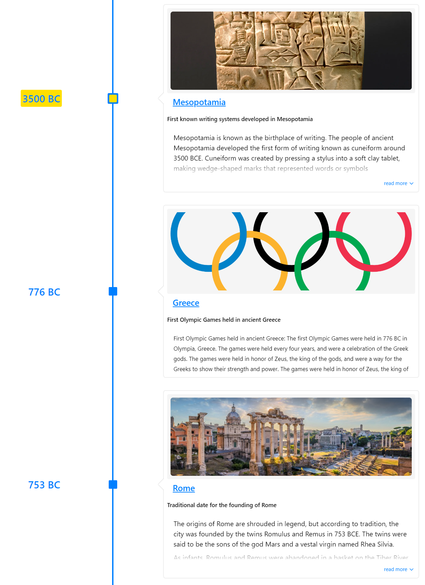
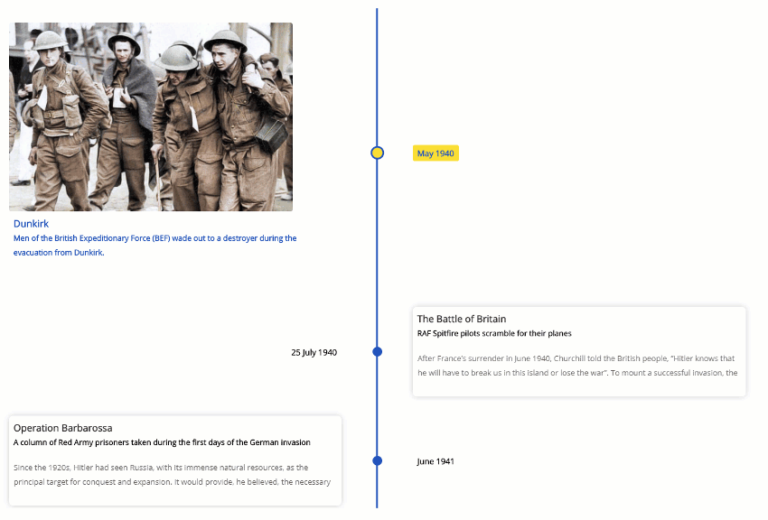

<div align="center">
  

  [](https://dev.azure.com/prabhummurthy/react-chrono/_build/latest?definitionId=7&branchName=master)
  [](https://deepscan.io/dashboard#view=project&tid=10074&pid=13644&bid=234929)
  [](https://www.codacy.com/manual/prabhuignoto/react-chrono?utm_source=github.com&amp;utm_medium=referral&amp;utm_content=prabhuignoto/react-chrono&amp;utm_campaign=Badge_Grade)
  
  [](https://depfu.com/github/prabhuignoto/react-chrono?project_id=15325)
  
  
  
</div>

<!-- **Try it on CodeSandbox!**

[](https://codesandbox.io/s/react-chrono-bg56e?fontsize=14&hidenavigation=1&theme=dark) -->

<h2>Features</h2>

- 🚥 Render timelines in three different modes ([Horizontal](#-getting-started), [Vertical](#vertical-mode), [Tree](#tree-view)).
- 🌲&nbsp; Use the [Tree](#tree-view) mode to layout the timeline cards vertically in a tree like fashion.
- 📺&nbsp; Auto play the timeline with the [slideshow](#slideshow-mode) mode.
- 🖼️&nbsp; [Display Images & Videos](#media) in the timeline with ease.
- ⌨&nbsp; [Keyboard accessible](#keyboard-navigation).
- ⚡&nbsp; Data driven API.
- 🔧&nbsp; Optimized to render images & videos efficiently on (Tree & Vertical mode).
- 🎨&nbsp; [Customize](#theme) colors with ease.
- 💪&nbsp; Built with [Typescript](https://www.typescriptlang.org/).
- 🎨&nbsp; Styled with [emotion](https://emotion.sh).

<h2>Table of Contents</h2>

- [⚡ Installation](#-installation)
- [🚀 Getting Started](#-getting-started)
  - [Vertical Mode](#vertical-mode)
  - [Tree](#tree)
  - [Slideshow](#slideshow)
- [Props](#props)
  - [Mode](#mode)
  - [Timeline item Model](#timeline-item-model)
  - [Keyboard Navigation](#keyboard-navigation)
  - [Media](#media)
  - [Slideshow mode](#slideshow-mode)
  - [Item Width](#item-width)
  - [Theme](#theme)
- [📦 CodeSandbox Examples](#-codesandbox-examples)
- [📦 Build Setup](#-build-setup)
- [🔨 Contributing](#-contributing)
- [🧱 Built with](#-built-with)
- [🎯 What's coming next](#-whats-coming-next)
- [Meta](#meta)

## ⚡ Installation

```sh
yarn install react-chrono
```

## 🚀 Getting Started

Please make sure you wrap the component in a container that has a `width` and `height`.

When no `mode` is specified, the component defaults to `HORIZONTAL` mode. Please check [props](#props) for all the available options.

```sh
  import React from "react"
  import { Chrono } from "react-chrono";
  
  const Home = () => {
    const items = [{
      title: "May 1940",
      contentTitle: "Dunkirk",
      contentText:"Men of the British Expeditionary Force (BEF) wade out to..",
      media: {
        type: "IMAGE",
        source: {
          url: "http://someurl/image.jpg"
        }
      }
    }, ...];

    return (
      <div style={{ width: "500px", height: "400px" }}>
        <Chrono items={items} cardHeight={300} />
      </div>
    )
  }
```


### Vertical Mode

To render the timeline vertically use the `VERTICAL` mode

```sh
  <div style={{ width: "500px", height: "950px" }}>
    <chrono
      items={items}
      mode="VERTICAL"
    />
  </div>
```



### Tree

In `Tree` mode the timeline is rendered vertically with cards alternating between left and right side.

```sh
  <div style={{ width: "500px", height: "950px" }}>
    <chrono
      items={items}
      mode="TREE"
    />
  </div>
```


### Slideshow

Play the timeline automatically with the `slideShow` mode.

```sh
  <div style={{ width: "500px", height: "950px" }}>
    <chrono
      items={items}
      slideShow
      mode="TREE"
    />
  </div>
```

<!--  -->

## Props

| name              | description                                                                           | default      |
| ----------------- | ------------------------------------------------------------------------------------- | ------------ |
| mode              | sets the mode of the component. can be `HORIZONTAL`, `VERTICAL` or `TREE` | `HORIZONTAL`             |
| items             | collection of [Timeline Item Model](#timeline-item-model).                            | []           |
| disableNavOnKey   | Disables keyboard navigation.                                                         | false        |
| slideShow         | Enables slideshow control.                                                            | false        |
| slideItemDuration | The amount of delay in `ms` for the timeline points in `slideshow` mode.              | 5000         |
| itemWidth         | width of the timeline section in `HORIZONTAL` mode.                                   | 300          |
| hideControls      | hides the navigation controls.                                                        | 300          |
| cardHeight        | sets the minimum height of the timeline card.                                         | 250          |
| theme             | prop to customize the colors.                                                         |              |

### Mode

`react-chrono` supports three modes `HORIZONTAL`, `VERTICAL` and `TREE`. No additional setting is required.

```sh
  <chrono items={items} mode="HORIZONTAL" />
```

```sh
  <chrono items={items} mode="VERTICAL" />
```

```sh
  <chrono items={items} mode="TREE" />
```

### Timeline item Model

| name                 | description                                  | type   |
|----------------------|----------------------------------------------|--------|
| title                | title of the timeline item                   | String |
| contentTitle         | title that is displayed on the timeline card | String |
| contentText          | text displayed in the timeline card          | String |
| contentDetailedText  | detailed text displayed in the timeline card | String |
| media                | media object to set image or video.          | Object |

```sh
{
  title: "May 1940",
  contentTitle: "Dunkirk",
  media: {
    name: "dunkirk beach",
    source: {
      url: "http://someurl/image.jpg"
    },
    type: "IMAGE"
  },
  contentText:
    "Men of the British Expeditionary Force (BEF) wade out to a destroyer during the evacuation from Dunkirk."
}
```

### Keyboard Navigation

The timeline can be navigated via keyboard.

- For `HORIZONTAL` mode use your <kbd>LEFT</kbd> <kbd>RIGHT</kbd> arrow keys for navigation.
- For `VERTICAL` or `TREE` mode, the timeline can be navigated via the <kbd>UP</kbd> <kbd>DOWN</kbd> arrow keys.
- To easily jump to the first item or the last item in the timeline, use <kbd>HOME</kbd> or <kbd>END</kbd> keys.

To disable keyboard navigation set `disableNavOnKey` to true.

```sh
<chrono items={items} disableNavOnKey />
```

### Media

Both images and videos can be embedded in the timeline. Just add the `media` attribute to the [Timeline Item model](#timeline-item-model) and the component will take care of the rest.

<h5>
  To embed a image
</h5>

```sh
{
  title: "May 1940",
  contentTitle: "Dunkirk",
  media: {
    name: "dunkirk beach",
    source: {
      url: "http://someurl/image.jpg"
    },
    type: "IMAGE"
  }
}
```

<h5>
  To embed a video
</h5>

Videos start playing automatically when active and will be automatically paused when not active. Like images, videos are also automatically hidden when not in the visible viewport of the container.

```sh
{
  title: "7 December 1941",
  contentTitle: "Pearl Harbor",
  media: {
    source: {
      url: "/pearl-harbor.mp4",
      type: "mp4"
    },
    type: "VIDEO",
    name: "Pearl Harbor"
  }
}
```

### Slideshow mode

Slideshow can be enabled by setting the `slideShow` prop to true. You can also set an optional `slideItemDuration` that sets the time delay between cards.

setting this prop enables the play button in the timeline control panel.

```sh
<chrono items={items} slideShow slideItemDuration={4500} />
```

### Item Width

The `itemWidth` prop can be used to set the width of each individual timeline sections. This setting is applicable only for the `HORIZONTAL` mode.

### Theme

Customize colors with `theme` prop.

```sh
<chrono items={items}  titlePosition="BOTTOM" theme={{primary: "red", secondary: "blue" }} />
```

## 📦 CodeSandbox Examples

- [Horizontal Basic](https://codesandbox.io/s/condescending-swirles-xodxo?file=/src/App.js)
- [Tree](https://codesandbox.io/s/react-chrono-tree-text-xtksq)
- [Tree with Images](https://codesandbox.io/s/react-chrono-tree-image-uh2nz)
- [Vertical basic](https://codesandbox.io/s/react-chrono-tree-text-slide-zytpi?file=/src/App.js)
- [Vertical mode with Mixed content](https://codesandbox.io/s/react-chrono-tree-horizontal-wdqk3)

## 📦 Build Setup

``` bash
# install dependencies
yarn install

# start dev setup
yarn run start

# run css linting
yarn run lint:css

# eslint
yarn run eslint

# prettier
yarn run lint

# package lib
yarn run rollup
```

## 🔨 Contributing

1. Fork it ( [https://github.com/prabhuignoto/react-chrono/fork](https://github.com/prabhuignoto/react-chrono/fork) )
2. Create your feature branch (`git checkout -b new-feature`)
3. Commit your changes (`git commit -am 'Add feature'`)
4. Push to the branch (`git push origin new-feature`)
5. Create a new Pull Request

## 🧱 Built with

- [Typescript](typescript).
- Styled with [emotion](emotion).
- Powered by [snowpack](snowpack)

## 🎯 What's coming next

- Support for Mobile devices & Tablets (responsive).

## Meta

Prabhu Murthy – [@prabhumurthy2](https://twitter.com/prabhumurthy2) – prabhu.m.murthy@gmail.com

Distributed under the MIT license. See `LICENSE` for more information.

[https://github.com/prabhuingoto/](https://github.com/prabhuingoto/)

<!-- Markdown link & img dfn's -->

[react]: https://reactjs.org
[typescript]: https://typescriptlang.org
[emotion]: https://emotion.sh/
[snowpack]: https://www.snowpack.dev/
